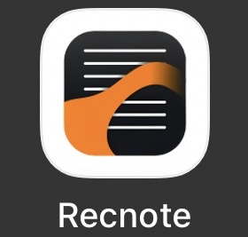
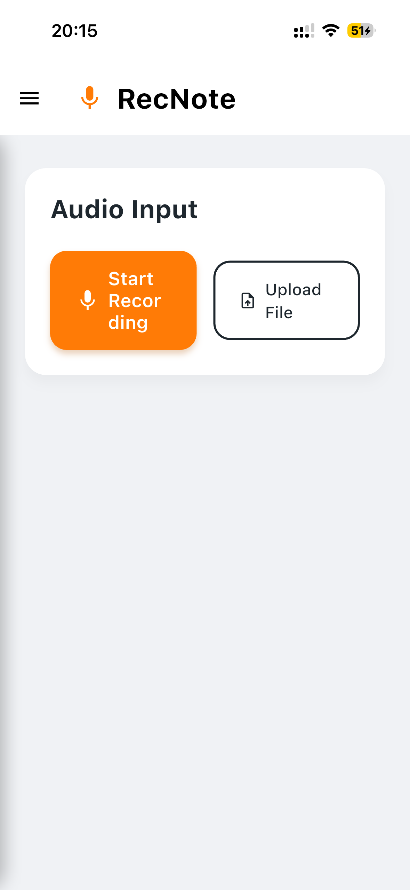
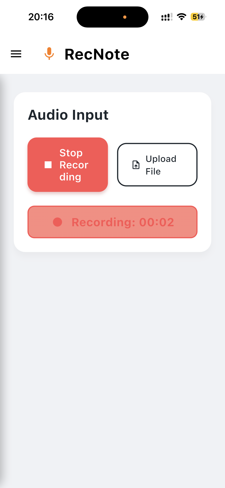
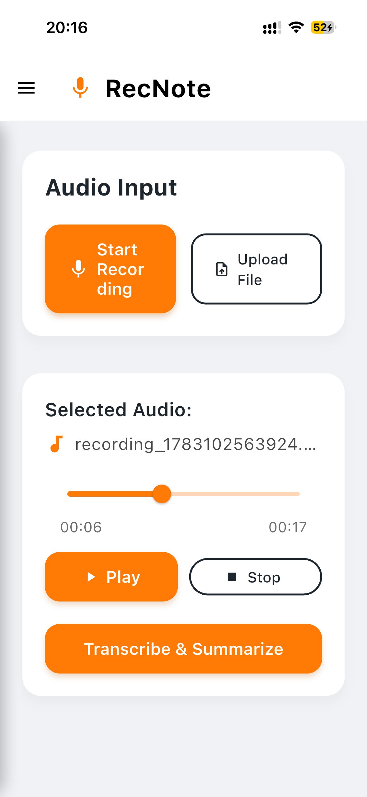
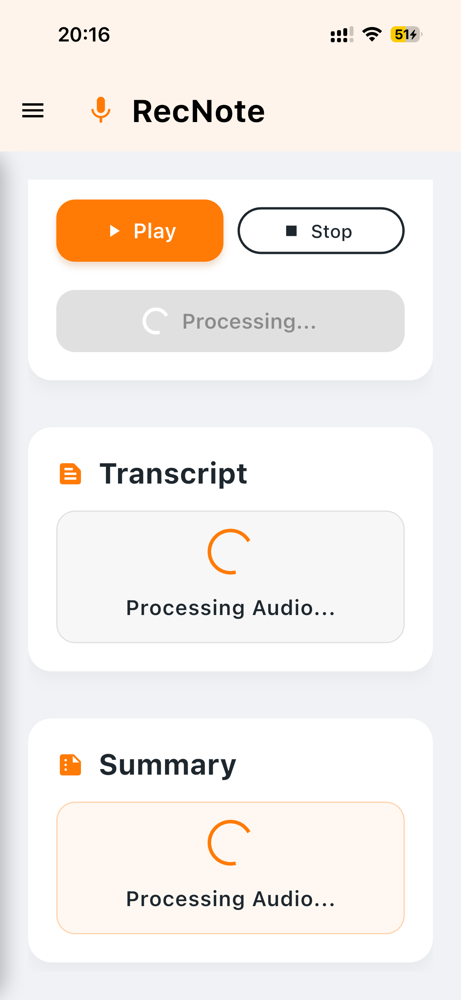
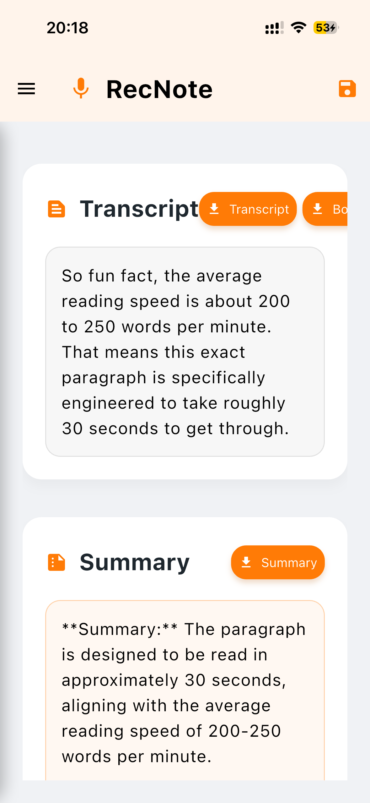
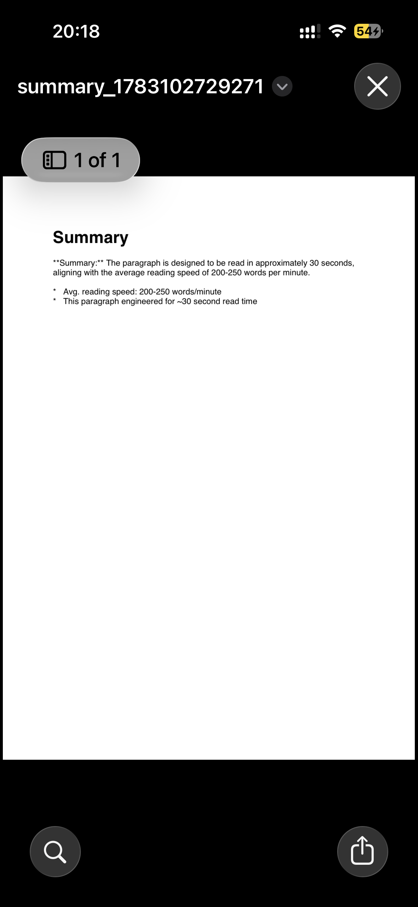
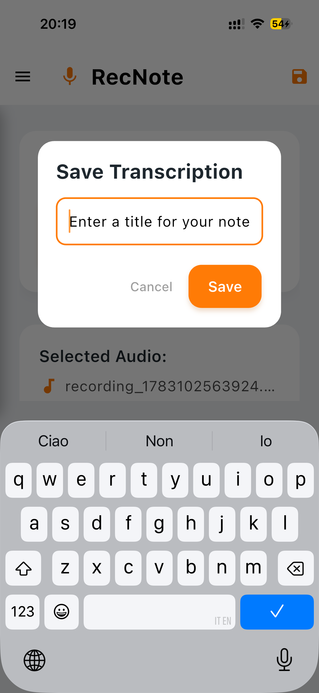
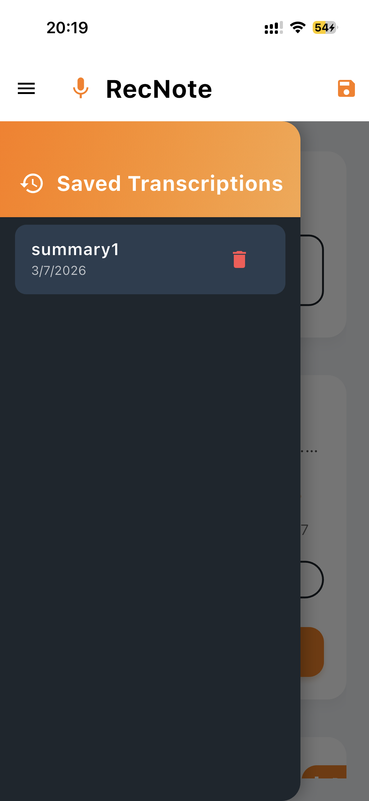

<p align="center">
  
</p>

<h1 align="center">RecNote</h1>

<p align="center">
  <strong>🎙️ Intelligent AI-Assisted Transcription & Structured Summaries 📝</strong>
</p>

<p align="center">
  Built with Flutter & Node.js • Powered by Google Gemini AI
</p>

---

RecNote is a beautiful, modern, AI-assisted transcription and summarization application built with **Flutter** and powered by a **Node.js** backend utilizing the **Google Gemini API** (`gemini-2.5-flash-lite`). It features a high-fidelity interface that allows users to capture live voice recordings or import files, instantly generating clean transcripts and bulleted note summaries.

---

## 📱 UI Showcase & App Walkthrough

### 🧩 Core App Journey
| 1. Main Dashboard | 2. Live Recording | 3. Audio Player & Timeline |
| --- | --- | --- |
|  |  |  |
| Clean UI layout with simple card components for audio initialization. | Live audio tracking badge with runtime state indicators. | Native media seeking timeline with dynamic play/stop buttons. |

### 🤖 AI Engine & Document Outputs
| 4. AI Processing State | 5. Transcripts & Summaries | 6. Document Export Preview |
| --- | --- | --- |
|  |  |  |
| Synchronized circular loading states while sending streams to Gemini. | AI-generated paragraphs paired with auto-formatted bullet points. | PDF rendering and preview engine powered by local platform viewing. |

### 💾 Naming, Saving & Note History Management
| 7. Custom Note Renaming | 8. Updated Sidebar History |
| --- | --- |
|  |  |
| Custom interactive modal to rename and individualize text transcriptions. | Sliding drawer mapping active saved notes with structured title fields and delete utilities. |

---

## 🚀 Core Features

* **Dual Audio Intake Paths:** 
    * **Live Recording:** Record microphone sessions natively (`.aac`).
    * **File Upload File Explorer:** Upload pre-recorded tracks (`.mp3`, `.wav`, `.m4a`, etc.).
* **Dynamic Audio Timeline Engine:** Play, stop, or scrub linearly across complex time tracks before firing processing loops.
* **Dual-Stage GenAI Pipelines:** Powered by `gemini-2.5-flash-lite`, the system converts audio to text, and subsequently runs a custom contextual prompt over the resulting transcript to create summaries in the target audio language.
* **Custom Note Persistence Interaction:** Prompted with a clean, branded dialog screen to give your transcriptions customized titles before locking them into active device storage.
* **Multipurpose PDF Generators:** One-tap compilation to cleanly formatted PDF files (supports Transcript-only, Summary-only, or Combined export).

---

## ⚙️ Engineering Architecture

### Frontend Technology Stack
* **Framework:** Flutter (Dart)
* **Audio Layer:** `flutter_sound` (Recording/Playback APIs) & `file_picker` (Native disk attachment)
* **Document Engine:** `pdf` (Layout engine) & `open_filex` (Native execution layer)

### Backend Architecture Middleware
* **Runtime Platform:** Node.js (Express framework runtime)
* **AI Core Integration:** Google GenAI SDK (`@google/genai`)
* **Storage Control:** `multer` configuration with automated temporary disk space clearing (`fs.unlink`).

---

## 📦 Setup & Deployment

### 1. Project Prerequisites
* [Flutter SDK](https://docs.flutter.dev/get-started/install) installed.
* [Node.js](https://nodejs.org/) (v18+ recommended) installed.
* A Gemini API Key from [Google AI Studio](https://aistudio.google.com/).

### 2. Platform Permission Setup
To ensure native media capabilities execute correctly across physical operating systems, verify the following configuration blocks:

#### Android (`android/app/src/main/AndroidManifest.xml`)
Ensure these rows reside inside the global `<manifest>` block:
```xml
<uses-permission android:name="android.permission.RECORD_AUDIO" />
<uses-permission android:name="android.permission.WRITE_EXTERNAL_STORAGE" />
<uses-permission android:name="android.permission.READ_EXTERNAL_STORAGE" />
```

#### iOS (`ios/Runner/Info.plist`)
Ensure these key-value mappings reside inside the primary <dict> tag:
```xml
<key>NSMicrophoneUsageDescription</key>
<string>RecNote requires microphone permission to record and transcribe audio notes.</string>
<key>NSAppleMusicUsageDescription</key>
<string>RecNote requires access to your music files to import pre-recorded audio.</string>
```

### 3. Middleware Server Setup
0. Navigate to your backend directory:
```xml
cd recnote-backend
```
1. Install the necessary NPM dependencies:
```xml
npm install
```
2. Set up your local environment file (.env):
```xml
PORT=3000
GEMINI_API_KEY=your_actual_gemini_api_key_here
```
3. Fire up your development server:
```xml
npm start
```
### 4. Client Application Setup
0. Validate your environment targets using standard command blocks:
```xml
flutter doctor
```
1. Open main.dart and confirm that your environment pointer reflects your live endpoint:
```xml
final String _baseUrl = '[https://your-backend-render-url.onrender.com/process-audio](https://your-backend-render-url.onrender.com/process-audio)';
```
2. Fetch your packages and launch your platform simulator:
```xml
flutter pub get
flutter run
```

